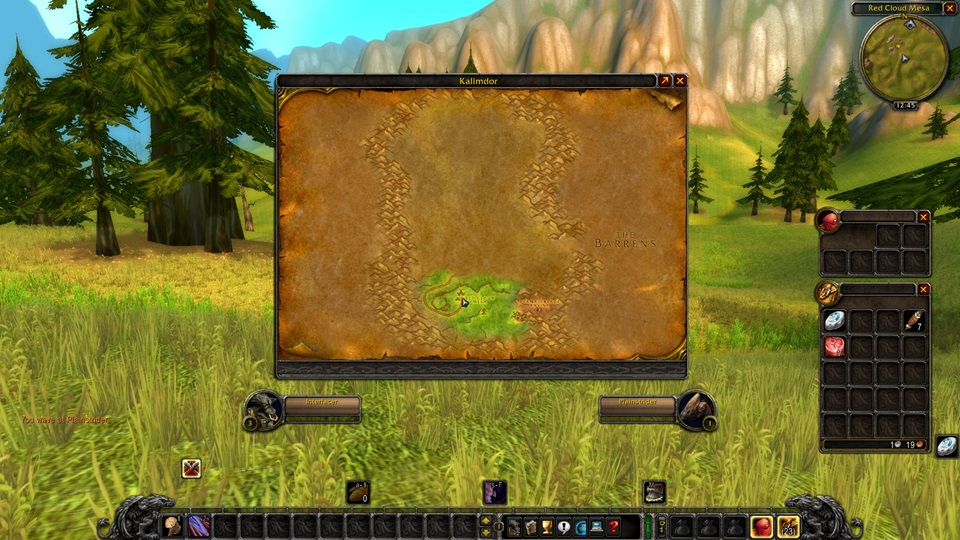

# ErzbaroneUI

A reduced World of Warcraft Classic Era Interface

## Usage

Extract the `ErzbaroneUI` directory from the release zip into the `World of Warcraft\_classic_era_\Interface\AddOns\` directory.
To open the configuration, you can click on the ErzbaroneUI flag beneath the Minimap or type `/eui`.

## Features

- Improved UnitFrames
- Bag Names removed
- Minimap zoom with mouse scroll and removed clutter
- Chat buttons only on mouse over
- Vertical actions bars only on mouse over
- Floating combat text font changed to skurri.ttf
- World map centered
- Five second rule timer
- Swing timer for main hand

## Screenshots

## Compability

I'm using the addon with a few other that worked well to complete the experience.

- DarkMode
- Better Vendor Price
- Classic Bag Search
- Questie
- Wide Quest Log Plus

## Credits

- [UnitFramesImproved](https://github.com/kiforsbe/UnitFramesImproved)
- [FiveSeconRule](https://github.com/smp4903/FiveSecondRule)
- [WeaponSwingTimer](https://github.com/LeftHandedGlove/WeaponSwingTimerAddon)
- [World of Warcraft Programming](https://wowprogramming.com/index.html)
