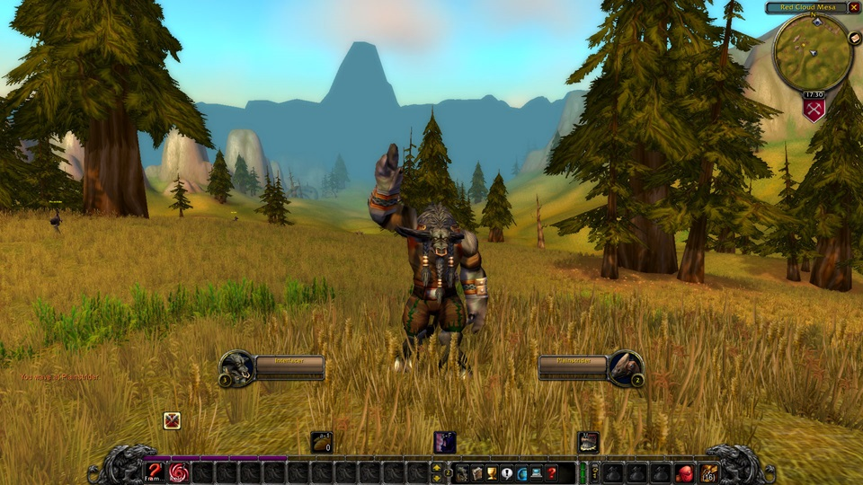

# ErzbaroneUI

A reduced World of Warcraft Classic Era Interface

## Features

- Improved UnitFrames
- Bag Names removed
- Minimap zoom with mouse scroll and removed clutter
- Chat buttons only on mouse over
- Vertical actions bars only on mouse over
- Floating combat text font changed to skurri.ttf
- World map centered

## Screenshots

## Compability

I'm using the addon with a few other that worked well to complete the experience.

- DarkMode
- Better Vendor Price
- Classic Bag Search
- Questie
- Wide Quest Log Plus

## Credits

- [UnitFramesImproved](https://github.com/kiforsbe/UnitFramesImproved) for the UnitFrame Textures
